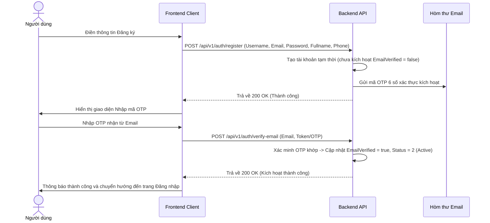
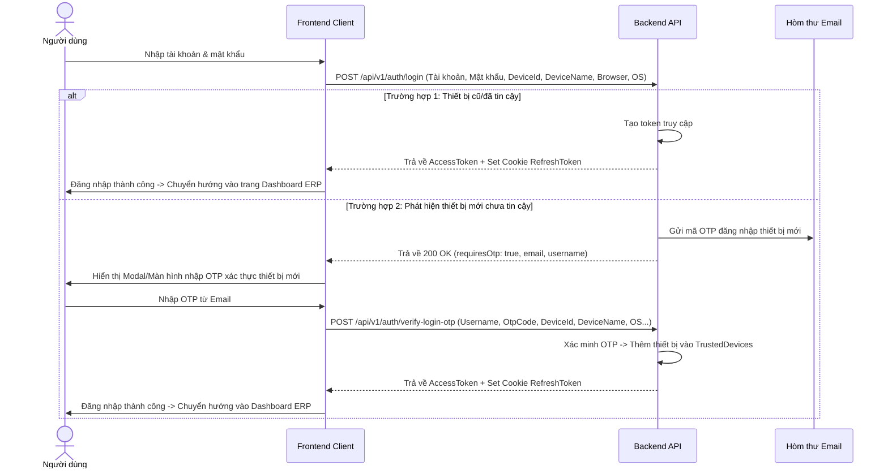
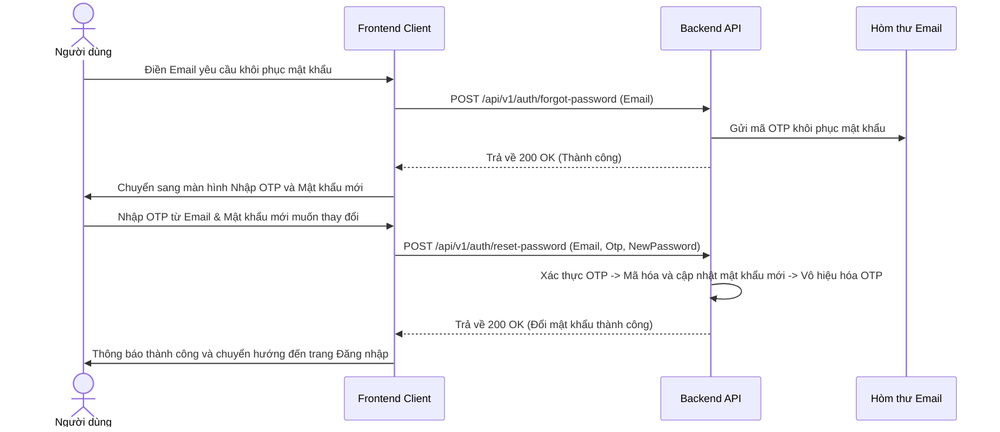
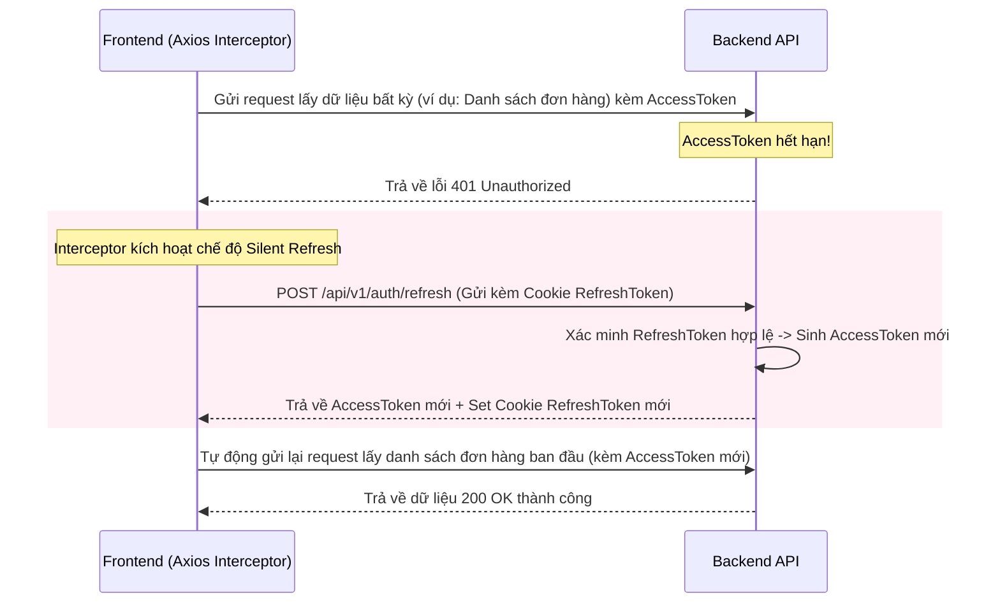
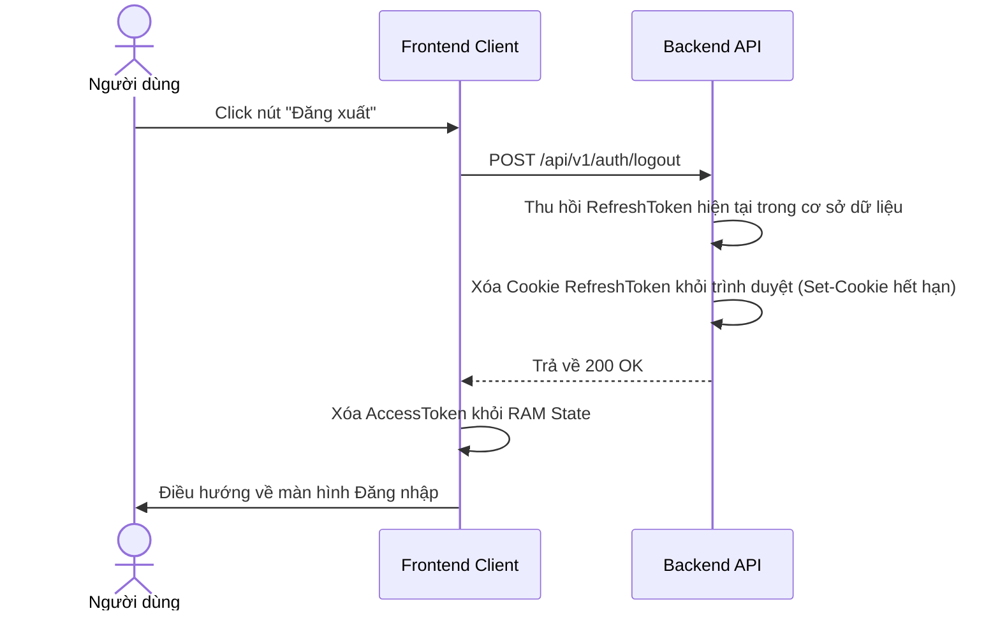

# Tài liệu toàn diện về Luồng xác thực & Gợi ý thiết kế Giao diện (UI/UX)

Tài liệu này bao gồm mô tả chi tiết tất cả các luồng nghiệp vụ xác thực (Authentication) của dự án và các gợi ý thiết kế giao diện tương ứng phía Client (Frontend) giúp tối ưu hóa trải nghiệm người dùng (UX) và bảo mật.

---

## BẢN ĐỒ TOÀN BỘ CÁC LUỒNG NGHIỆP VỤ (ALL AUTHENTICATION FLOWS)

---

## 1. Luồng Đăng ký & Kích hoạt tài khoản (Register & Verify Email)

### Sơ đồ tuần tự (Sequence Diagram)

### Đặc tả API liên quan
* **Đăng ký:** `POST /api/v1/auth/register`
  * Body: `{ "username", "email", "password", "fullname", "phone" }`
* **Xác thực Email:** `POST /api/v1/auth/verify-email`
  * Body: `{ "email", "token" }` (ở đây `token` truyền vào là mã OTP 6 số)
* **Gửi lại mã OTP:** `POST /api/v1/auth/resend-otp`
  * Body: `{ "email" }`

### Gợi ý Thiết kế Giao diện (UI/UX Suggestions)
1. **Màn hình Đăng ký (Register Page):**
   * **Layout:** Một form dọc thanh lịch giữa trang (hoặc chia đôi màn hình: bên trái hình ảnh minh họa/banner ERP, bên phải form đăng ký).
   * **Các trường:** Username, Email, Số điện thoại, Họ tên, Mật khẩu, Xác nhận mật khẩu.
   * **UX Helper:** Kiểm tra định dạng Email và độ mạnh mật khẩu ngay khi người dùng đang gõ (Real-time Validation). Sử dụng nút "Con mắt" để ẩn/hiện mật khẩu.
2. **Màn hình Nhập OTP (OTP Verification Page):**
   * **Layout:** Thiết kế 6 ô nhập số riêng biệt (mỗi ô 1 số) tự động chuyển con trỏ sang ô tiếp theo khi gõ (Auto-focus next input).
   * **UX Helper:** 
     * Hiển thị dòng chữ: *"Mã OTP đã được gửi đến email **mario*****@gmail.com***" để bảo mật thông tin.
     * Thiết lập nút **"Gửi lại mã OTP"** kèm theo **đồng hồ đếm ngược (Countdown Timer 60 giây)**. Nút gửi lại chỉ sáng lên khi bộ đếm lùi về 0 để tránh người dùng spam gửi liên tục phá hoại tài nguyên.

---

## 2. Luồng Đăng nhập & Xác thực thiết bị mới (Login & Device Verification)

### Sơ đồ tuần tự (Sequence Diagram)

### Đặc tả API liên quan
* **Đăng nhập:** `POST /api/v1/auth/login`
  * Body: `{ "username", "password", "deviceId", "deviceName", "browser", "operatingSystem", "ipAddress", "userAgent" }`
* **Xác thực OTP đăng nhập:** `POST /api/v1/auth/verify-login-otp`
  * Body: `{ "username", "otpCode", "deviceId", "deviceName", "browser", "operatingSystem", "ipAddress", "userAgent" }`

### Gợi ý Thiết kế Giao diện (UI/UX Suggestions)
1. **Màn hình Đăng nhập (Login Page):**
   * **Bố cục:** Thiết kế hiện đại tối giản. Có tuỳ chọn ghi nhớ đăng nhập ("Ghi nhớ tôi").
   * **Cách lấy DeviceId:** Frontend tự động sinh ra một chuỗi UUID duy nhất và lưu vào `localStorage` của trình duyệt. Chuỗi này sẽ được gửi lên Backend ở mỗi lần đăng nhập như là `deviceId` cố định của trình duyệt đó.
2. **Màn hình Xác thực Thiết bị mới (Device Verification UI):**
   * Thay vì chuyển hướng trang, hãy hiển thị một **Modal (hộp thoại nổi đè lên trên)** hoặc màn hình phụ yêu cầu nhập mã OTP bảo mật.
   * **UX Helper:** Hiển thị thông tin thiết bị đang đăng nhập để người dùng nhận biết (Ví dụ: *"Bạn đang đăng nhập từ Chrome trên Windows tại Hà Nội, vui lòng nhập mã OTP để xác nhận thiết bị"*).

---

## 3. Luồng Quên & Đặt lại mật khẩu (Forgot & Reset Password)

### Sơ đồ tuần tự (Sequence Diagram)

### Đặc tả API liên quan
* **Yêu cầu khôi phục mật khẩu:** `POST /api/v1/auth/forgot-password`
  * Body: `{ "email" }`
* **Đặt lại mật khẩu:** `POST /api/v1/auth/reset-password`
  * Body: `{ "email", "otp", "newPassword" }`

### Gợi ý Thiết kế Giao diện (UI/UX Suggestions)
1. **Trang Yêu cầu Quên mật khẩu:**
   * Một form đơn giản chỉ có trường nhập **Email**.
   * Nút bấm gửi có hiệu ứng loading để ngăn người dùng click liên tục khi email đang được gửi đi.
2. **Trang Đặt lại mật khẩu mới:**
   * Gồm các trường: Mã OTP (6 số), Mật khẩu mới, Nhập lại mật khẩu mới.
   * **Bảo mật:** Mật khẩu mới bắt buộc phải thoả mãn các tiêu chuẩn tối thiểu (độ dài, ký tự đặc biệt, số) và hiển thị thanh đo độ mạnh (Password Strength Meter) màu xanh/đỏ trực quan.

## 4. Luồng Làm mới Token ngầm (Silent Refresh Token Flow)

Luồng này chạy ngầm dưới background của ứng dụng Frontend để người dùng không bị văng ra ngoài đăng nhập lại khi Access Token hết hạn (Access Token thường chỉ có hạn 15 - 30 phút, còn Refresh Token hạn 7 ngày).

### Sơ đồ tuần tự (Sequence Diagram)

### Đặc tả API liên quan
* **Làm mới Token:** `POST /api/v1/auth/refresh`
  * Request không cần truyền tham số lên body vì `refreshToken` được Backend đọc trực tiếp từ **HttpOnly Cookie** bảo mật mà trình duyệt tự gửi đính kèm.

### Gợi ý Thiết kế Giao diện / Lập trình Client
* **Hoàn toàn không có giao diện cho phần này.** Luồng này chạy ngầm 100%.
* **Kiến trúc FE:** Cài đặt một bộ lọc chặn **HTTP Interceptor** (ví dụ Axios Interceptor). 
  * Khi bắt được mã lỗi `401` từ Backend, interceptor sẽ tạm dừng toàn bộ các request khác đang xếp hàng, gọi API `/refresh` trước.
  * Nếu refresh thành công -> lưu AccessToken mới vào bộ nhớ ứng dụng và cho phép các request đang bị dừng tiếp tục chạy.
  * Nếu refresh thất bại (Refresh Token cũng hết hạn sau 7 ngày) -> Xóa toàn bộ session, hiện thông báo *"Phiên đăng nhập đã hết hạn, vui lòng đăng nhập lại"* và đẩy người dùng ra trang Đăng nhập.

---

## 5. Luồng Đăng xuất (Logout)

### Sơ đồ tuần tự (Sequence Diagram)

### Đặc tả API liên quan
* **Đăng xuất:** `POST /api/v1/auth/logout`
  * Request không cần truyền tham số lên body (hoặc truyền rỗng), Backend đọc RefreshToken từ Cookie để xoá.

### Gợi ý Thiết kế Giao diện (UI/UX Suggestions)
* Nút Đăng xuất thường được bố trí ở menu thả xuống của góc trên bên phải (avatar người dùng) hoặc ở chân thanh menu điều hướng bên trái (Sidebar).
* Nên hiển thị một hộp thoại xác nhận nhỏ (Confirm Dialog) khi người dùng click: *"Bạn có chắc chắn muốn đăng xuất khỏi hệ thống?"* để tránh trường hợp bấm nhầm.
